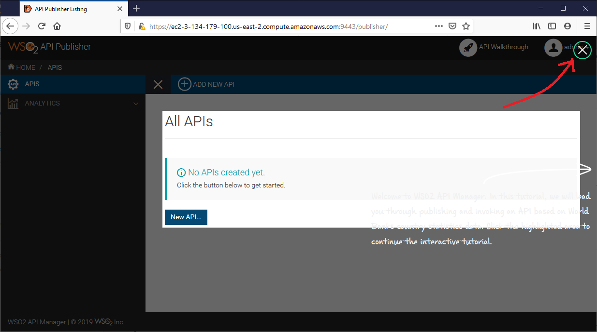
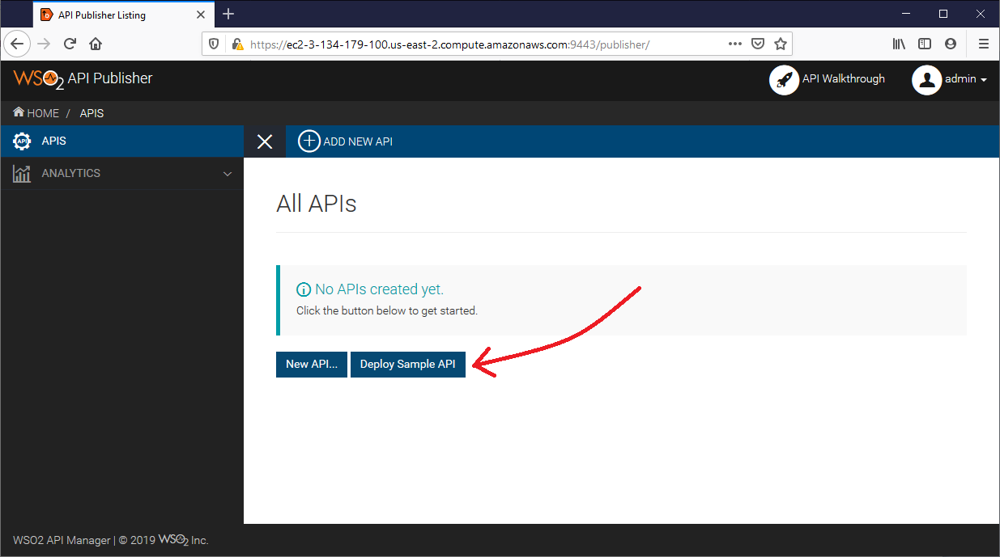
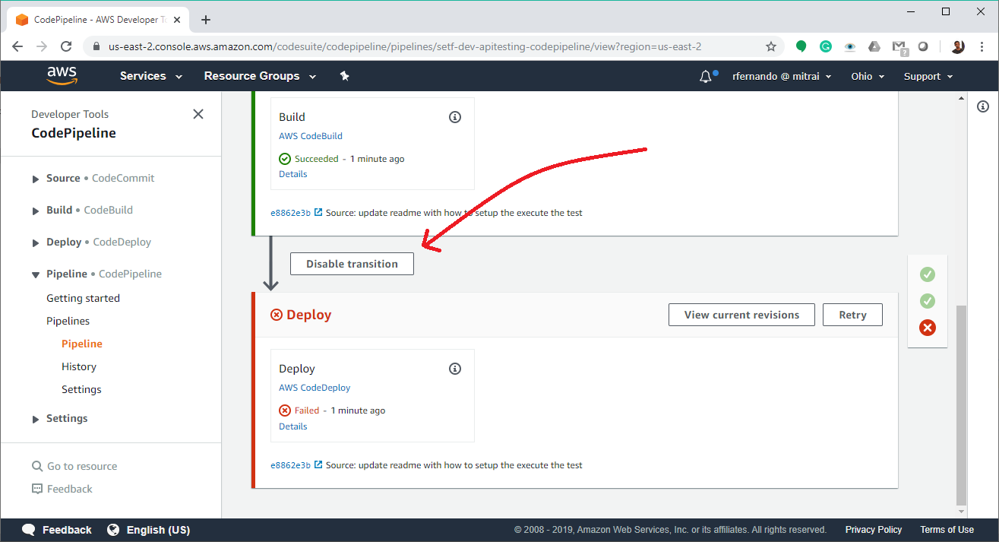

# Terraform AWS API Newman Test

AWS pipeline example for API testing using Newman.

## 1. Use-case

This repository contains code to spin WSO2 API Manager instance in AWS EC2 instance, AWS CodePipeline that executes Newman tests and will not deploy anything.

## 2. Code Structure

```
.
+-- buildspec.yml
+-- terraform
|   +-- main.tf
|   +-- variables.tf
|   +-- modules
|       +-- wso2-apim-ec2
|           +-- main.tf
|   +-- resources
|       +-- ssh-key
|           +-- wso2-apim-aws
|           +-- wso2-apim-aws.pub
+-- postman
|   +-- footer.html
|   +-- header.html
```

### 2.1. buildspec.yml file

This file contains the runtime environment, build commands to execute tests.

### 2.2. terraform directory

This directory contains terraform modules to build the infrastructure.
- module `wso2-apim-ec2`: Create a VPC, spin an EC2 instance and run a docker WSO2 API Manager container.
- `main.tf` file: Use above module `wso2-apim-ec2` and creates a AWS CodePipeline using [terraform-aws-codepipeline](https://github.com/MitraInnovationRepo/terraform-aws-codepipeline).
- ssh-keys: Use to provision and remote-execution to spin docker container.

### 2.3. postman directory

This directory contains API testing postman collection and environment details.

## 3. Steps to Execute Tests in the Pipeline

This sample is supposed to build infrastructure in the region `us-east` (Ohio).

### 3.1. Create An EIP

Go to [AWS Console](https://us-east-2.console.aws.amazon.com/ec2/home?region=us-east-2#Addresses:) and `Allocate Elastic IP address` and create a tag with
- Key = "Name"
- Value = "SETF-WSO2-APIM-EIP"

Extract the IP address

### 3.2 Change host

Open the file [wso2-apim-AWS-mitrai.postman_environment.json](postman/wso2-apim-AWS-mitrai.postman_environment.json) and change host values to be valid with above extracted IP address.

```json
{
    "key": "*****Host",
    "value": "https://ec2-{{IP address with replacing dots with dashes}}.us-east-2.compute.amazonaws.com:8243",
    "enabled": true
}
```

Example

```json
{
    "key": "*****Host",
    "value": "https://ec2-3-134-179-100.us-east-2.compute.amazonaws.com:8243",
    "enabled": true
}
```


### 3.3 Create a GitHub Token

1. Visit https://github.com/settings/tokens and create a GitHub token.
1. Add the GitHub token with creating files `terraform/terraform.tfvars` OR find the file in the directory `terraform.tfvars.template`, replace the token value and rename the file as `terraform.tfvars`.

```hcl-terraform
github_token = "*******************************************"
```

### 3.4. Build Infrastructure

Execute the following.

```bash
cd terraform
terraform init
terraform apply
```

### 3.5. Deploy Default API

Visit the following link.

```bash
https://ec2-{{IP address with replacing dots with dashes}}.us-east-2.compute.amazonaws.com:9443/publisher
```

Sign in to the API Manager using following user name and password. Deploy the default API.

```bash
user: admin
password: admin

```





### 3.6. Deploy Default API

Goto the [pipeline](https://us-east-2.console.aws.amazon.com/codesuite/codepipeline/pipelines?region=us-east-2) and disable the deploy transaction.



Retry the build.

### 3.7. Destruct infrastructure

Execute the following.

```bash
terraform destroy
```